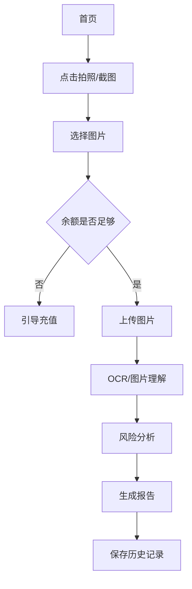
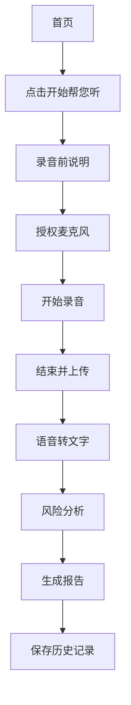

# 防诈助手 MVP 原型文档

## 1. 原型目标

本原型用于评审 MVP 的核心用户路径，不追求完整视觉设计稿精度，重点验证：

- 用户是否能理解“帮您看”和“帮您听”；
- 用户是否能顺利上传图片或录音；
- 报告结构是否清晰可信；
- 高风险提醒是否足够明确；
- 历史记录和我的页面是否满足基础闭环。

配套静态 HTML 原型文件：

- `prototype/anti-fraud-assistant-mvp.html`

## 2. 全局设计原则

### 2.1 用户体验原则

- 文字简单直接，避免专业金融术语堆砌。
- 关键按钮大且明显，适合中老年用户点击。
- 高风险结论要醒目，但不能制造过度恐慌。
- 每个报告都必须给出“为什么”和“下一步怎么办”。
- 对录音、图片、隐私和扣费要提前说明。

### 2.2 视觉风格

- 背景：温和浅灰白；
- 卡片：白色，轻阴影；
- 主色：绿色，用于“帮您看”；
- 辅色：陶土橙，用于“帮您听”和风险提醒；
- 高风险：橙红色；
- 极高风险：红色；
- 字体：系统默认中文字体，字号偏大。

### 2.3 导航结构

```text
首页
历史记录
我的
```

业务流程页通过返回按钮回到上一层，不进入底部 Tab。

## 3. 页面清单

| 页面 | 类型 | MVP 必要性 |
| --- | --- | --- |
| 首页 | Tab | 必做 |
| 图片上传页 | 流程页 | 必做 |
| 图片分析中页 | 状态页 | 必做 |
| 图片报告页 | 结果页 | 必做 |
| 录音准备页 | 流程页 | 必做 |
| 录音中页 | 流程页 | 必做 |
| 录音报告页 | 结果页 | 必做 |
| 历史记录页 | Tab | 必做 |
| 我的页 | Tab | 必做 |
| 充值页 | 流程页 | MVP 可简化 |
| 协议/隐私页 | 内容页 | 必做 |

## 4. 首页原型

### 4.1 页面结构

```text
┌────────────────────────┐
│ 您好！                  │
│ 帮看帮听                │
│ 帮您判断宣传是否可信，以防上当受骗 │
│                         │
│ ┌────────────────────┐ │
│ │ 帮您看       20点/次 │
│ │ 拍照或截图，一秒看懂是真是假、值不值得买 │
│ │ [ 拍照 / 截图 ]       │
│ └────────────────────┘ │
│                         │
│ ┌────────────────────┐ │
│ │ 帮您听     10点/分钟 │
│ │ 录音分析对话，识破套路话术，及时提醒你 │
│ │ [ 开始帮您听 ]        │
│ └────────────────────┘ │
│                         │
│ 首页 | 历史记录 | 我的     │
└────────────────────────┘
```

### 4.2 交互

- 点击“拍照 / 截图”：进入图片上传页；
- 点击“开始帮您听”：进入录音准备页；
- 点击“历史记录”：进入历史记录页；
- 点击“我的”：进入我的页。

### 4.3 文案

标题：

```text
帮看帮听
```

副标题：

```text
帮您判断宣传是否可信，以防上当受骗
```

## 5. 图片上传页

### 5.1 页面结构

```text
┌────────────────────────┐
│ < 帮您看                 │
│ 上传宣传材料              │
│ 拍摄或上传聊天截图、海报、合同、付款页面 │
│                         │
│ ┌────────────────────┐ │
│ │ +                  │
│ │ 拍照 / 选择图片      │
│ └────────────────────┘ │
│                         │
│ 已选图片：0/3             │
│ 本次将消耗 20 点           │
│ [ 开始分析 ]              │
└────────────────────────┘
```

### 5.2 状态

空状态：

- 上传区域显示加号；
- 开始分析按钮置灰。

已选择图片：

- 显示缩略图；
- 可删除；
- 开始分析按钮可点击。

点数不足：

- 弹窗提示余额不足；
- 引导充值。

### 5.3 异常

- 图片过大：提示压缩或重新选择；
- 上传失败：提示重试；
- OCR 失败：进入人工提示式错误页，点数退回。

## 6. 图片报告页

### 6.1 页面结构

```text
┌────────────────────────┐
│ < 分析报告                │
│                         │
│ 风险等级 高风险            │
│ 疑似保本高收益投资诱导       │
│                         │
│ 当前内容存在明显风险信号，建议暂停付款 │
│ 并核实对方资质。            │
│                         │
│ 建议动作                  │
│ 1. 不要继续转账或提供验证码   │
│ 2. 发给家人共同确认         │
│ 3. 查询官方资质             │
│                         │
│ 主要风险点                │
│ • 保本高收益               │
│ • 内部消息                 │
│ • 限时名额                 │
│                         │
│ 关键证据                  │
│ “稳赚不赔”                │
│ “内部渠道”                │
│                         │
│ [ 分享给家人 ] [ 再分析一次 ] │
└────────────────────────┘
```

### 6.2 报告模块

1. 风险概览；
2. 建议动作；
3. 主要风险点；
4. 关键证据；
5. 原始材料；
6. 免责声明。

## 7. 录音准备页

### 7.1 页面结构

```text
┌────────────────────────┐
│ < 帮您听                 │
│ 录音前提醒                │
│                         │
│ 请将电话外放，或让手机靠近正在沟通的人声。 │
│ 系统会分析对话中的风险话术，仅供参考。 │
│                         │
│ 当前计费：10点/分钟        │
│ 当前余额：120点            │
│                         │
│ [ 开始录音 ]              │
└────────────────────────┘
```

### 7.2 交互

- 点击开始录音：申请麦克风权限；
- 授权成功：进入录音中页；
- 授权失败：展示权限引导。

## 8. 录音中页

### 8.1 页面结构

```text
┌────────────────────────┐
│ 帮您听                   │
│                         │
│ 00:38                    │
│ 正在录音                  │
│                         │
│ 可能风险提醒              │
│ 检测到“保证收益”“名额有限”等话术 │
│                         │
│ [ 暂停 ] [ 结束并分析 ]     │
└────────────────────────┘
```

### 8.2 MVP 交互

- 开始录音；
- 暂停；
- 继续；
- 结束；
- 上传；
- 分析。

### 8.3 二期交互

- 每 15 秒上传音频切片；
- 返回实时转写；
- 触发高危话术提醒；
- 结束后合并生成完整报告。

## 9. 录音报告页

### 9.1 页面结构

```text
┌────────────────────────┐
│ < 帮您听                 │
│ [ 播放录音 ]              │
│                         │
│ 风险分析                  │
│ 虚假内幕消息与保本承诺       高风险 │
│ 2026-04-22 10:00          │
│                         │
│ 当前内容有较强风险信号，建议立即提高警惕 │
│ 并暂停配合。               │
│                         │
│ 风险点                    │
│ • 冒充正规机构             │
│ • 声称拥有内幕消息          │
│ • 承诺亏损补差             │
│ • 利用紧急感催促决定        │
│                         │
│ 关键原文                  │
│ “这个项目保证收益”          │
│ “现在只有几个名额”          │
│ “亏了我们给你补”            │
│                         │
│ 分析时间 2026-04-22 10:00  录音时长 02:10 │
│ [ 分享给家人 ] [ 再听一次 ] │
└────────────────────────┘
```

## 10. 历史记录页

### 10.1 页面结构

```text
┌────────────────────────┐
│ 历史记录                  │
│ [全部] [高风险] [图片] [录音] │
│                         │
│ 高风险  帮您听             │
│ 虚假内幕消息与保本承诺       │
│ 2026-04-22 10:00          │
│                         │
│ 中风险  帮您看             │
│ 疑似夸大收益宣传            │
│ 2026-04-20 14:30          │
└────────────────────────┘
```

### 10.2 空状态

```text
还没有分析记录
上传图片或开始录音后，报告会保存在这里
```

## 11. 我的页面

### 11.1 页面结构

```text
┌────────────────────────┐
│ 我的                     │
│                         │
│ 点数余额：120点           │
│ [ 充值点数 ]              │
│                         │
│ 使用记录                  │
│ 充值记录                  │
│ 用户协议                  │
│ 隐私政策                  │
│ 联系客服                  │
│ 删除我的数据              │
└────────────────────────┘
```

## 12. 关键流程图

### 12.1 图片分析流程



### 12.2 录音分析流程



