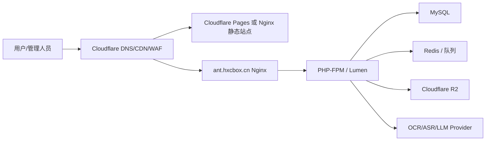

# 守护者max 生产部署方案

## 项目信息
- 正式项目名：守护者max
- 主域名：`hxcbox.cn`，已接入 Cloudflare CDN
- 对象存储：Cloudflare R2
- 前端主线：`apps/client`，`uni-app + Vue 3 + TypeScript`，优先发布 H5，再同步小程序/App
- 后端服务：`www/service.antifraud.local.com`，Lumen API
- 公共基础服务：`www/service.storage.company.com`，承载文件、用户、钱包和支付
- LLM：第三方中转 API，通过环境变量配置 `LLM_BASE_URL`、`LLM_API_KEY`、`LLM_MODEL`

## 推荐域名规划
- `https://ant.hxcbox.cn`：反诈主服务 API，Cloudflare 代理到服务器 Nginx/PHP-FPM
- `https://file.hxcbox.cn`：独立文件服务 API / 文件访问域名
- 用户端 H5：部署 `apps/client/dist/build/h5`，如暂时没有独立 H5 域名，可先和主站域名或后续子域名绑定
- 管理端：后续建议新增独立域名和 `apps/admin`

管理端建议同仓库实现，但前端工程独立放在 `apps/admin`。后端管理接口继续放在当前 Lumen 服务的 `/management/proxy/*` 路由下，这样权限、日志、业务模型和部署链路都能复用。

## 部署架构


## H5 发布流程
1. 进入 `apps/client`。
2. 设置生产 API 地址：`VITE_API_BASE_URL=https://ant.hxcbox.cn`。
3. 设置公共文件服务地址：`VITE_FILE_BASE_URL=https://file.hxcbox.cn`。
4. 执行 `npm ci`。
5. 执行 `npm run build:h5`。
6. 将 `apps/client/dist/build/h5` 发布到 Cloudflare Pages，或上传到服务器 Nginx 静态目录。

H5 同时依赖反诈主服务和公共文件服务，不再写死本地 `127.0.0.1:8000`。

## 后端发布流程（Laradock）
生产环境已有 Laradock 时，优先复用现有 `nginx / php-fpm / workspace / mysql / redis`，不需要启用仓库里的 Docker Compose 骨架。

以下示例假设代码在 Laradock 的 `/var/www` 挂载目录下，容器内路径为 `/var/www/service-antifraud`；如果你的 Laradock `APP_CODE_PATH_HOST` 或项目目录名不同，同步替换路径即可。

## 本地 Laradock 验证
本地已有 Laradock 时，建议先在本机完整跑一遍 MVP，再上线。当前本地推荐使用：

- 反诈本地域名：`http://service.antifraud.local.hxc`
- 公共服务本地域名：`http://service.storage.company.hxc`
- 容器内部互调：`COMMON_SERVICE_BASE_URL=http://nginx/service/api/v1`，并设置 `COMMON_SERVICE_HOST=service.storage.company.hxc`
- MySQL 使用 Laradock 的 `mysql` 容器；对象存储可以直接使用线上 R2 配置。

首次本地验证：

```bash
cd /Users/hxc/Documents/php/laradock

docker compose up -d nginx php-fpm workspace mysql redis

docker compose exec mysql mysql -uroot -proot -e "CREATE DATABASE IF NOT EXISTS service_antifraud_local DEFAULT CHARACTER SET utf8mb4 COLLATE utf8mb4_unicode_ci; CREATE DATABASE IF NOT EXISTS service_common_local DEFAULT CHARACTER SET utf8mb4 COLLATE utf8mb4_unicode_ci;"

docker compose exec workspace bash -lc 'cd /var/www/my-project/service-antifraud/www/service.storage.company.com && composer install && php artisan migrate --force'
docker compose exec workspace bash -lc 'cd /var/www/my-project/service-antifraud/www/service.antifraud.local.com && composer install && php artisan migrate --force'
```

本地 smoke：

```bash
cd /Users/hxc/Documents/php/laradock
docker compose exec workspace bash -lc 'cd /var/www/my-project/service-antifraud && bash docs/scripts/smoke-laradock-local.sh'
```

该脚本会验证：反诈健康检查、公共文件服务、验证码登录、项目钱包、微信支付 mock 到账、R2 上传、反诈文件注册、图片分析和报告生成。生产环境不要开启 `WECHAT_LOGIN_MOCK` 和 `WECHAT_PAY_MOCK`。

1. 将代码发布到 Laradock 挂载目录，例如：

```bash
cd /path/to/laradock/..
git clone <repo> service-antifraud
```

2. 复制两个 Nginx 站点配置到 Laradock：

```bash
cp service-antifraud/docs/laradock/nginx-sites/ant.hxcbox.cn.conf laradock/nginx/sites/ant.hxcbox.cn.conf
cp service-antifraud/docs/laradock/nginx-sites/file.hxcbox.cn.conf laradock/nginx/sites/file.hxcbox.cn.conf
```

如果你的容器内项目路径不是 `/var/www/service-antifraud`，需要修改两个 conf 里的 `root`。

3. 启动 Laradock 基础服务：

```bash
cd laradock
docker compose up -d nginx php-fpm workspace mysql redis
```

4. 进入项目根目录，复制生产环境配置：

```bash
cd /path/to/service-antifraud
cp www/service.antifraud.local.com/.env.production.example www/service.antifraud.local.com/.env
cp www/service.storage.company.com/.env.production.example www/service.storage.company.com/.env
```

填写 `www/service.antifraud.local.com/.env` 的 `APP_KEY`、`DB_*`、公共服务、LLM 等真实配置；填写 `www/service.storage.company.com/.env` 的 `APP_KEY`、`DB_*`、对象存储、微信登录、微信支付和 `SERVICE_SECRET` 等真实配置。两个服务的 `COMMON_SERVICE_SECRET` / `SERVICE_SECRET` 必须一致。

Laradock 内置 MySQL 常用主机名是 `mysql`，Redis 常用主机名是 `redis`。如果你使用云数据库，把两个服务的 `DB_HOST` 改成云数据库地址即可。

5. 执行生产配置检查，确保未遗漏真实密钥、未保留 `change-me`、未开启微信 mock，且公共服务签名密钥一致：

```bash
bash docs/scripts/check-prod-env.sh
```

6. 在 workspace 容器内安装依赖并执行迁移：

```bash
cd /path/to/laradock

docker compose exec workspace bash -lc 'cd /var/www/service-antifraud/www/service.storage.company.com && composer install --no-dev --optimize-autoloader && php artisan migrate --force'
docker compose exec workspace bash -lc 'cd /var/www/service-antifraud/www/service.antifraud.local.com && composer install --no-dev --optimize-autoloader && php artisan migrate --force'
```

7. 启动反诈队列 worker。临时验证可直接运行：

```bash
docker compose exec workspace bash -lc 'cd /var/www/service-antifraud/www/service.antifraud.local.com && php artisan queue:work --tries=3 --timeout=300'
```

生产建议放进 Laradock supervisor，命令为：

```bash
cd /var/www/service-antifraud/www/service.antifraud.local.com && php artisan queue:work --tries=3 --timeout=300
```

8. 重载 Nginx：

```bash
docker compose exec nginx nginx -t
docker compose exec nginx nginx -s reload
```

9. 访问 `http://服务器IP/api/v1/system/health` 并带 `Host: ant.hxcbox.cn` 验证反诈服务；访问 `http://服务器IP/service/api/v1/file/disks` 并带 `Host: file.hxcbox.cn` 验证公共服务。
10. Cloudflare 将 `ant.hxcbox.cn` 和 `file.hxcbox.cn` 都代理到该服务器 80/443；SSL 模式建议使用 Full strict，源站配置有效证书。

部署后可以先跑最小 smoke：

```bash
SMOKE_ACCOUNT=smoke@example.com SMOKE_CODE=123456 \
ANT_BASE_URL=https://ant.hxcbox.cn FILE_BASE_URL=https://file.hxcbox.cn \
bash docs/scripts/smoke-mvp.sh
```

该脚本会验证：反诈健康检查、公共文件服务、验证码登录、`/api/v1/me`、套餐列表和公共钱包余额。生产环境不会返回 `debug_code`，需要从真实短信/邮箱验证码通道取得验证码后通过 `SMOKE_CODE` 传入。

如果已经通过小程序 `wx.login` 拿到绑定 openid 的公共 token，可以追加微信预支付单检查：

```bash
SMOKE_WECHAT_TOKEN=真实微信登录token SMOKE_PACKAGE_ID=套餐ID \
SMOKE_ACCOUNT=smoke@example.com SMOKE_CODE=123456 \
ANT_BASE_URL=https://ant.hxcbox.cn FILE_BASE_URL=https://file.hxcbox.cn \
bash docs/scripts/smoke-mvp.sh
```

该步骤只校验 JSAPI/小程序支付下单参数；真实支付成功、微信回调验签和钱包到账仍需要在微信客户端完成付款后，再查钱包余额和流水确认。

确认基础服务正常后，跑完整文件和分析链路 smoke：

```bash
SMOKE_ACCOUNT=smoke@example.com SMOKE_CODE=123456 \
ANT_BASE_URL=https://ant.hxcbox.cn FILE_BASE_URL=https://file.hxcbox.cn \
bash docs/scripts/smoke-e2e-analysis.sh
```

该脚本会验证：验证码登录、公共钱包、公共文件上传、反诈文件注册；如果测试账号已有至少 20 点，会继续创建图片分析并轮询到报告完成。若账号点数不足，脚本会提示先完成微信支付充值后重跑；设置 `SMOKE_REQUIRE_ANALYSIS=true` 可要求点数不足时直接失败。

当前 MVP 涉及两个后端服务。非 Docker 部署或分服务发布时，至少执行以下迁移：

```bash
cd www/service.storage.company.com
php artisan migrate --force

cd ../service.antifraud.local.com
php artisan migrate --force
```

公共服务会创建用户、身份、token、验证码、项目钱包、钱包流水、支付套餐、支付订单、公共文件归属字段和 `failed_jobs`；反诈服务会创建/升级分析记录、文件素材、项目用户映射、LLM 字段和 `failed_jobs`。

本地验证时如果只想使用本机已有镜像，先把 `API_HTTP_PORT` 改成未占用端口，例如 `18080`，再执行：

```bash
docker compose --env-file www/service.antifraud.local.com/.env -f docs/docker/backend/docker-compose.prod.yml up -d --build --pull never
```

非 Docker 部署也可以继续使用 Nginx + PHP-FPM + MySQL + Redis：PHP 生产版本建议使用 8.2 或 8.3，执行 `composer install --no-dev --optimize-autoloader` 后，把 Nginx root 指向 `www/service.antifraud.local.com/public`。

## Cloudflare 配置
- DNS：
  - `ant.hxcbox.cn` 指向反诈主服务服务器，并开启代理。
  - `file.hxcbox.cn` 指向独立文件服务服务器，或绑定对象存储自定义域名。
  - H5 若单独发布，建议追加独立前端域名并写入主服务 `CORS_ALLOWED_ORIGINS`。
- 安全：
  - 对 `/api/v1/auth/*` 和分析接口加基础限流。
  - 管理端上线前可先用 Cloudflare Access 保护管理端域名。
  - 后端 `CORS_ALLOWED_ORIGINS` 只允许正式 H5、管理端域名。

## 生产前确认项
- 公共服务：`SERVICE_APP_ID`、`SERVICE_SECRET` 必须和反诈服务 `COMMON_SERVICE_APP_ID`、`COMMON_SERVICE_SECRET` 保持一致。
- 登录注册：非微信环境走邮箱/手机号验证码登录，公共服务会自动创建用户；生产必须配置 `VERIFICATION_CODE_WEBHOOK_URL` 发送验证码。微信环境走 `auth/wechat-login`，公共服务通过 `WECHAT_MINI_PROGRAM_APP_ID` / `WECHAT_MINI_PROGRAM_APP_SECRET` 调微信 `jscode2session` 绑定 openid。
- 文件上传：用户端已直传 `file.hxcbox.cn/service/api/v1/file/upload`，上传后调用反诈服务 `/api/v1/files/register` 建立业务文件关系。
- OCR/ASR/LLM：第三方中转 API 配置 `LLM_BASE_URL`、`LLM_API_KEY`、`LLM_MODEL`、`LLM_VISION_MODEL`、`LLM_AUDIO_MODEL`；未配置时会回退到文件摘要和关键词规则。
- 队列：分析任务通过 `AnalyzeRiskJob` 派发；生产建议将 `QUEUE_CONNECTION` 配为 Redis 并启动 `php artisan queue:work --tries=3 --timeout=300`，两边服务均已提供 `failed_jobs` 表。
- 微信支付：填写 `WECHAT_PAY_APP_ID`、`WECHAT_PAY_MCH_ID`、`WECHAT_PAY_API_V3_KEY`、`WECHAT_PAY_MERCHANT_SERIAL_NO`、商户私钥路径或内容、微信支付平台证书路径或内容，并保持 `WECHAT_PAY_MOCK=false`；真实支付要求用户已通过微信登录绑定 openid。
- 管理端鉴权：当前已有管理 API 入口，正式管理后台仍需补登录、角色、操作日志和按钮权限。
- 备份：MySQL 每日备份，R2 生命周期规则，关键日志保留策略。

## 上线顺序
1. 先部署后端测试环境，跑通 migration 和 `/api/v1/system/health`。
2. 再部署 H5，确认 CORS、验证码登录/注册、报告列表可用。
3. 配置公共服务用户、钱包、微信支付环境变量，确认点数套餐可查询。
4. 联调公共文件服务上传和反诈 `/files/register`。
5. 配置 LLM/OCR/ASR 供应商并验证图片、音频分析。
6. 开 Cloudflare WAF/限流，关闭 `APP_DEBUG`。
7. 上线管理端最小版本，先覆盖分析记录、规则、失败重试和用户点数流水。

## MVP 线上验收清单
- 域名与网关：`https://ant.hxcbox.cn/api/v1/system/health` 返回 `code=0`，`https://file.hxcbox.cn/service/api/v1/file/disks` 返回 `code=0`。
- 登录注册：H5 邮箱/手机号验证码登录能自动注册新用户；小程序 `wx.login` 能换取公共 token 并绑定 openid。
- 文件链路：H5/小程序上传图片或音频到 `file.hxcbox.cn/service/api/v1/file/upload`，再调用 `ant.hxcbox.cn/api/v1/files/register` 生成 `file_assets`。
- 钱包链路：套餐列表可查询；微信支付成功回调后 `payment_orders` 幂等变为 `paid`，`project_wallets.balance` 增加，流水 `wallet_transactions` 一致。
- 分析链路：点数足够时创建图片/音频分析返回 `pending`；队列 worker 执行后变为 `success`，报告包含风险等级、风险项、建议和免责声明。
- 失败链路：LLM/OCR/ASR 失败时任务变为 `failed`，公共钱包冻结点数释放；管理端 `/management/proxy/analysis/{recordId}/retry` 只能重试 failed 记录。
- Agent 链路：配置 `LLM_BASE_URL`、`LLM_API_KEY`、`LLM_MODEL`、`LLM_VISION_MODEL`、`LLM_AUDIO_MODEL` 后，图片和音频都能产生结构化 JSON 报告；关闭 LLM 时关键词 fallback 仍能生成基础报告。
- 前端链路：报告页 pending/processing 会轮询，success 展示报告，failed 展示错误和重新提交入口；历史记录能区分处理中、失败和已完成风险等级。
