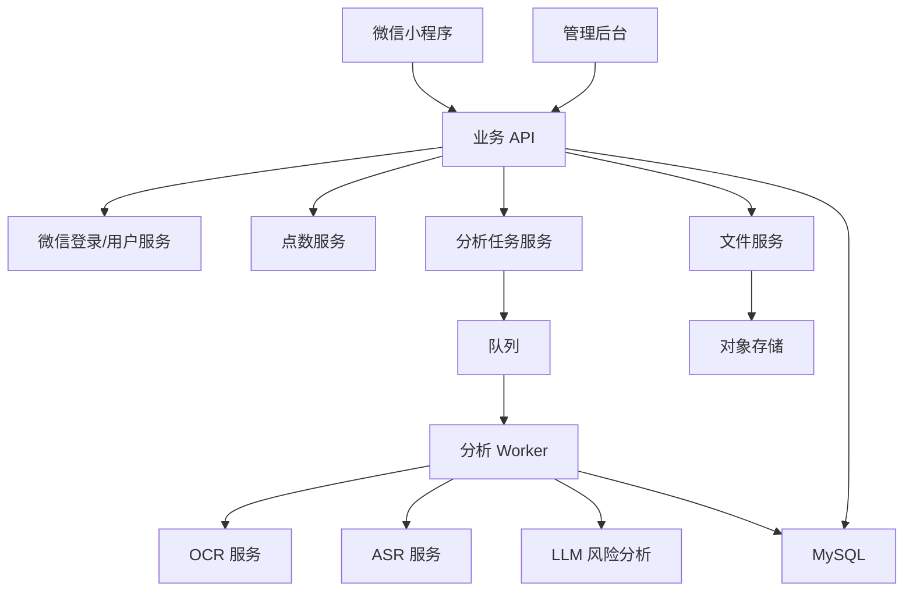
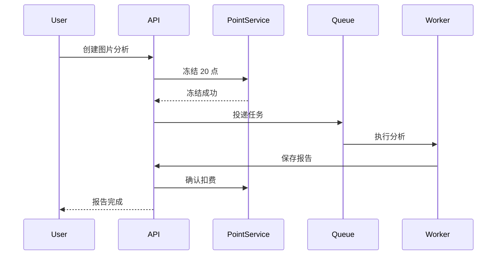

# 防诈助手技术开发文档

## 1. 技术目标

MVP 需要支持微信小程序端、业务后端、AI 分析服务、管理后台和基础支付能力，形成从上传材料到生成报告、扣费、历史记录保存的完整闭环。

优先目标：

- 稳定完成图片分析；
- 稳定完成录音分析；
- 报告结构化；
- 点数扣费准确；
- 用户数据隔离；
- 文件可删除；
- 后台可追踪失败任务。

## 2. 推荐技术栈

### 2.1 前端

首选：

- 微信小程序原生；

备选：

- uni-app + Vue 3；
- Taro + React。

如果只做微信小程序，原生开发成本最低、微信能力最稳定。如果未来确定要同时做 App/H5，可选择 uni-app。

### 2.2 后端

推荐：

- Laravel 10/11 或 Lumen；
- MySQL；
- Redis；
- 队列：Redis Queue 或 RabbitMQ；
- 对象存储：腾讯云 COS 或阿里云 OSS。

也可选：

- NestJS；
- FastAPI。

### 2.3 AI 能力

OCR：

- 腾讯云 OCR；
- 阿里云 OCR；
- PaddleOCR 私有化；
- 大模型视觉能力。

ASR：

- 腾讯云语音识别；
- 阿里云智能语音交互；
- 讯飞开放平台；
- Whisper 或兼容服务。

LLM：

- OpenAI；
- 通义千问；
- 腾讯混元；
- DeepSeek；
- 其他支持结构化 JSON 输出的大模型。

MVP 建议用云服务，先验证产品价值，不建议一开始私有化部署 OCR/ASR。

## 3. 系统架构



## 4. 服务模块

### 4.1 用户服务

职责：

- 微信登录；
- openid/unionid 绑定；
- 用户资料；
- 点数余额；
- 用户状态；
- 注销和数据删除。

### 4.2 文件服务

职责：

- 生成上传凭证；
- 接收上传回调；
- 存储文件元信息；
- 控制文件访问权限；
- 文件删除；
- 敏感文件生命周期管理。

### 4.3 点数服务

职责：

- 查询余额；
- 冻结点数；
- 确认扣费；
- 失败解冻；
- 充值入账；
- 流水记录。

### 4.4 分析任务服务

职责：

- 创建分析任务；
- 校验余额；
- 投递队列；
- 更新任务状态；
- 生成分析记录；
- 失败重试；
- 通知前端查询结果。

### 4.5 AI 分析服务

职责：

- OCR 识别；
- ASR 转写；
- 风险规则匹配；
- 调用大模型；
- 结构化输出；
- 结果校验；
- 脱敏处理。

### 4.6 管理后台

职责：

- 用户管理；
- 分析记录管理；
- 文件管理；
- 点数流水；
- 风险规则配置；
- 失败任务重试；
- 内容审核；
- 数据删除审计。

## 5. 数据库设计

### 5.1 users

```sql
CREATE TABLE users (
  id BIGINT UNSIGNED PRIMARY KEY AUTO_INCREMENT,
  openid VARCHAR(128) NOT NULL UNIQUE,
  unionid VARCHAR(128) NULL,
  nickname VARCHAR(128) NULL,
  avatar_url VARCHAR(512) NULL,
  points_balance INT NOT NULL DEFAULT 0,
  status TINYINT NOT NULL DEFAULT 1,
  last_login_at DATETIME NULL,
  created_at DATETIME NOT NULL,
  updated_at DATETIME NOT NULL
);
```

### 5.2 analysis_records

```sql
CREATE TABLE analysis_records (
  id BIGINT UNSIGNED PRIMARY KEY AUTO_INCREMENT,
  user_id BIGINT UNSIGNED NOT NULL,
  type VARCHAR(20) NOT NULL,
  title VARCHAR(255) NOT NULL,
  risk_level VARCHAR(20) NOT NULL,
  risk_score INT NOT NULL DEFAULT 0,
  summary TEXT NOT NULL,
  suggestions JSON NULL,
  status VARCHAR(20) NOT NULL DEFAULT 'pending',
  cost_points INT NOT NULL DEFAULT 0,
  frozen_points INT NOT NULL DEFAULT 0,
  image_count INT NOT NULL DEFAULT 0,
  duration_seconds INT NOT NULL DEFAULT 0,
  analyzed_at DATETIME NULL,
  created_at DATETIME NOT NULL,
  updated_at DATETIME NOT NULL,
  INDEX idx_user_created (user_id, created_at),
  INDEX idx_risk_level (risk_level),
  INDEX idx_type (type)
);
```

### 5.3 risk_items

```sql
CREATE TABLE risk_items (
  id BIGINT UNSIGNED PRIMARY KEY AUTO_INCREMENT,
  record_id BIGINT UNSIGNED NOT NULL,
  category VARCHAR(64) NOT NULL,
  severity VARCHAR(20) NOT NULL,
  description TEXT NOT NULL,
  evidence_text TEXT NULL,
  created_at DATETIME NOT NULL,
  updated_at DATETIME NOT NULL,
  INDEX idx_record (record_id)
);
```

### 5.4 file_assets

```sql
CREATE TABLE file_assets (
  id BIGINT UNSIGNED PRIMARY KEY AUTO_INCREMENT,
  user_id BIGINT UNSIGNED NOT NULL,
  record_id BIGINT UNSIGNED NULL,
  file_type VARCHAR(20) NOT NULL,
  storage_key VARCHAR(512) NOT NULL,
  file_url VARCHAR(1024) NULL,
  mime_type VARCHAR(100) NULL,
  file_size BIGINT UNSIGNED NOT NULL DEFAULT 0,
  ocr_text LONGTEXT NULL,
  transcript_text LONGTEXT NULL,
  deleted_at DATETIME NULL,
  created_at DATETIME NOT NULL,
  updated_at DATETIME NOT NULL,
  INDEX idx_user_record (user_id, record_id)
);
```

### 5.5 point_transactions

```sql
CREATE TABLE point_transactions (
  id BIGINT UNSIGNED PRIMARY KEY AUTO_INCREMENT,
  user_id BIGINT UNSIGNED NOT NULL,
  related_record_id BIGINT UNSIGNED NULL,
  amount INT NOT NULL,
  balance_after INT NOT NULL,
  type VARCHAR(30) NOT NULL,
  status VARCHAR(20) NOT NULL,
  remark VARCHAR(255) NULL,
  created_at DATETIME NOT NULL,
  updated_at DATETIME NOT NULL,
  INDEX idx_user_created (user_id, created_at),
  INDEX idx_related_record (related_record_id)
);
```

### 5.6 risk_rules

```sql
CREATE TABLE risk_rules (
  id BIGINT UNSIGNED PRIMARY KEY AUTO_INCREMENT,
  category VARCHAR(64) NOT NULL,
  keyword VARCHAR(255) NOT NULL,
  severity VARCHAR(20) NOT NULL,
  weight INT NOT NULL DEFAULT 10,
  enabled TINYINT NOT NULL DEFAULT 1,
  created_at DATETIME NOT NULL,
  updated_at DATETIME NOT NULL,
  INDEX idx_enabled (enabled),
  INDEX idx_category (category)
);
```

## 6. API 设计

接口统一前缀：

```text
/api/v1
```

### 6.1 登录

```http
POST /api/v1/auth/wechat-login
```

请求：

```json
{
  "code": "wx_login_code"
}
```

响应：

```json
{
  "token": "jwt_token",
  "user": {
    "id": 1,
    "points_balance": 120
  }
}
```

### 6.2 获取用户信息

```http
GET /api/v1/me
```

响应：

```json
{
  "id": 1,
  "nickname": "微信用户",
  "avatar_url": "",
  "points_balance": 120
}
```

### 6.3 创建上传凭证

```http
POST /api/v1/files/upload-token
```

请求：

```json
{
  "file_type": "image",
  "mime_type": "image/jpeg",
  "file_size": 204800
}
```

响应：

```json
{
  "file_id": 1001,
  "upload_url": "https://oss.example.com/upload",
  "storage_key": "uploads/1/2026/05/xxx.jpg"
}
```

### 6.4 创建图片分析任务

```http
POST /api/v1/analysis/image
```

请求：

```json
{
  "file_ids": [1001, 1002]
}
```

响应：

```json
{
  "record_id": 2001,
  "status": "pending",
  "frozen_points": 20
}
```

### 6.5 创建录音分析任务

```http
POST /api/v1/analysis/audio
```

请求：

```json
{
  "file_id": 1003,
  "duration_seconds": 130
}
```

响应：

```json
{
  "record_id": 2002,
  "status": "pending",
  "frozen_points": 30
}
```

### 6.6 查询分析结果

```http
GET /api/v1/analysis/{record_id}
```

响应：

```json
{
  "id": 2001,
  "type": "image",
  "title": "疑似保本高收益投资诱导",
  "risk_level": "high",
  "risk_score": 86,
  "summary": "当前内容存在明显风险信号，建议暂停付款并核实对方资质。",
  "suggestions": [
    "不要继续转账或提供验证码",
    "发给家人共同确认",
    "查询官方资质"
  ],
  "risk_items": [
    {
      "category": "保本高收益",
      "severity": "high",
      "description": "对方承诺收益且暗示无风险",
      "evidence_text": "稳赚不赔，亏了我们补"
    }
  ],
  "cost_points": 20,
  "created_at": "2026-05-04 14:30:00"
}
```

### 6.7 历史记录

```http
GET /api/v1/analysis-records?type=image&risk_level=high&page=1&page_size=20
```

响应：

```json
{
  "items": [
    {
      "id": 2001,
      "type": "image",
      "title": "疑似保本高收益投资诱导",
      "risk_level": "high",
      "cost_points": 20,
      "created_at": "2026-05-04 14:30:00"
    }
  ],
  "total": 1
}
```

### 6.8 删除记录

```http
DELETE /api/v1/analysis/{record_id}
```

响应：

```json
{
  "success": true
}
```

### 6.9 点数流水

```http
GET /api/v1/points/transactions?page=1&page_size=20
```

### 6.10 创建支付订单

```http
POST /api/v1/payments/wechat/order
```

请求：

```json
{
  "package_id": "points_100"
}
```

响应：

```json
{
  "payment_params": {}
}
```

## 7. 分析任务状态机

```text
pending
  -> processing
  -> completed
  -> failed
  -> refunded
```

状态说明：

| 状态 | 含义 |
| --- | --- |
| pending | 已创建任务，等待队列处理 |
| processing | 正在 OCR/ASR/LLM 分析 |
| completed | 分析成功，已扣点 |
| failed | 分析失败，等待重试或退款 |
| refunded | 已退回冻结点数 |

## 8. AI 分析流程

### 8.1 图片分析

```text
1. 获取图片文件
2. 调用 OCR 提取文字
3. 调用图片理解模型补充视觉信息
4. 使用风险规则库匹配高危词
5. 构造 LLM 提示词
6. 要求 LLM 输出 JSON
7. 校验 JSON 结构
8. 保存报告
9. 确认扣费
```

### 8.2 录音分析

```text
1. 获取音频文件
2. 调用 ASR 转写
3. 对转写文本做分段
4. 使用风险规则库匹配高危话术
5. 构造 LLM 提示词
6. 要求 LLM 输出 JSON
7. 校验 JSON 结构
8. 保存报告和关键证据
9. 确认扣费
```

### 8.3 LLM 提示词要求

模型必须输出结构化 JSON，不允许输出 Markdown。

分析维度：

- 是否承诺保本高收益；
- 是否冒充正规机构；
- 是否提到内幕消息；
- 是否催促立刻付款；
- 是否要求私下转账；
- 是否要求提供验证码、银行卡、身份证；
- 是否要求共享屏幕或下载陌生 App；
- 是否要求隐瞒家人；
- 是否有可核验资质。

输出字段：

- risk_level；
- risk_score；
- title；
- summary；
- suggestions；
- risk_items；
- evidence；
- disclaimer。

### 8.4 JSON 校验

后端需要校验：

- risk_level 必须是 low/medium/high/critical；
- risk_score 必须是 0-100；
- title 不超过 50 字；
- summary 不超过 200 字；
- suggestions 至少 1 条，最多 5 条；
- risk_items 最多 8 条；
- evidence_text 中不得包含完整身份证、银行卡等敏感信息。

## 9. 点数扣费流程

### 9.1 图片扣费



### 9.2 录音扣费

```text
cost_points = ceil(duration_seconds / 60) * 10
```

示例：

- 1-60 秒：10 点；
- 61-120 秒：20 点；
- 121-180 秒：30 点。

## 10. 小程序开发要点

### 10.1 页面路由

```text
pages/home/index
pages/image-upload/index
pages/image-analyzing/index
pages/audio-ready/index
pages/audio-recording/index
pages/report/index
pages/history/index
pages/profile/index
pages/recharge/index
pages/agreement/index
pages/privacy/index
```

### 10.2 微信能力

需要使用：

- `wx.login`
- `wx.chooseMedia`
- `wx.uploadFile`
- `wx.getRecorderManager`
- `wx.authorize`
- `wx.requestPayment`
- `wx.shareAppMessage`

### 10.3 轮询策略

分析任务创建后，前端轮询报告状态：

```text
前 30 秒：每 2 秒轮询一次
30 秒后：每 5 秒轮询一次
超过 90 秒：提示稍后在历史记录查看
```

## 11. 管理后台

### 11.1 菜单

```text
仪表盘
用户管理
分析记录
文件管理
点数流水
支付订单
风险规则
失败任务
系统配置
```

### 11.2 关键功能

- 查询用户分析记录；
- 查看 OCR/ASR 结果；
- 查看 LLM 原始输出；
- 重新分析；
- 手动退款点数；
- 配置风险关键词；
- 禁用异常用户；
- 删除用户数据。

## 12. 安全设计

### 12.1 鉴权

- 小程序端使用 JWT；
- 后台使用管理员账号和 RBAC；
- 支付回调单独验签；
- 文件访问使用临时签名 URL。

### 12.2 数据隔离

- 所有记录查询必须带 user_id；
- 后台操作写审计日志；
- 文件下载需要权限校验；
- 删除记录时同步标记文件删除。

### 12.3 敏感信息

需要脱敏：

- 手机号；
- 身份证；
- 银行卡；
- 验证码；
- 详细住址；
- 人脸图片元数据。

## 13. 错误处理

| 场景 | 处理 |
| --- | --- |
| 上传失败 | 提示重试，不扣点 |
| OCR 失败 | 标记任务失败，释放冻结点数 |
| ASR 失败 | 标记任务失败，释放冻结点数 |
| LLM 输出非法 | 自动重试一次 |
| 队列超时 | 提示稍后查看，后台继续处理 |
| 扣费失败 | 报告不展示，进入人工处理 |
| 支付回调失败 | 可重放回调，保证幂等 |

## 14. 日志与监控

需要记录：

- API 请求日志；
- 上传日志；
- OCR/ASR 调用耗时；
- LLM 调用耗时和错误；
- 分析任务状态变化；
- 点数冻结/扣费/退款；
- 支付回调；
- 后台管理员操作。

监控指标：

- 分析成功率；
- 平均分析耗时；
- OCR 失败率；
- ASR 失败率；
- LLM JSON 解析失败率；
- 队列堆积数；
- 支付成功率；
- 用户投诉和退款数。

## 15. 开发排期

### 第 1 周：产品与基础工程

- 完成需求评审；
- 完成 UI 设计；
- 搭建小程序工程；
- 搭建后端工程；
- 设计数据库；
- 接入微信登录；
- 完成用户和点数基础接口。

### 第 2 周：图片分析闭环

- 图片选择和上传；
- 文件服务；
- OCR 接入；
- 风险规则匹配；
- LLM 分析；
- 图片报告页；
- 历史记录基础。

### 第 3 周：录音分析闭环

- 录音权限；
- 录音控制；
- 音频上传；
- ASR 接入；
- 录音报告页；
- 按分钟扣点；
- 异常退款。

### 第 4 周：支付、后台和安全

- 微信支付；
- 充值套餐；
- 点数流水；
- 管理后台；
- 风险规则管理；
- 文件删除；
- 隐私协议；
- 分享能力。

### 第 5 周：测试与优化

- 端到端测试；
- 弱网测试；
- 大文件测试；
- 支付回调测试；
- 数据权限测试；
- 报告文案优化；
- 上线准备。

## 16. MVP 验收清单

- 微信登录可用；
- 新用户赠送点数；
- 图片上传分析成功；
- 录音上传分析成功；
- 报告内容结构完整；
- 历史记录可查询；
- 点数扣除准确；
- 分析失败自动退点；
- 微信支付充值可用；
- 用户可删除记录；
- 协议和隐私政策可查看；
- 后台可查看任务和失败原因；
- 高风险报告可分享给家人。

